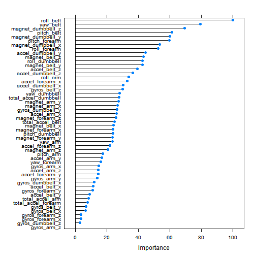

"Practical Machine Learning - Course Project writeup"
-----------------------------------------------------------------
## Assignment background
Using devices such as Jawbone Up, Nike FuelBand, and Fitbit it is now possible to collect a large amount of data about personal activity relatively inexpensively. In this project, our goal will be to use data from accelerometers on the belt, forearm, arm, and dumbell of 6 participants. They were asked to perform one set of 10 repetitions of the Unilateral Dumbbell Biceps Curl in five different fashions: exactly according to the specification (Class A), throwing the elbows to the front (Class B), lifting the dumbbell only halfway (Class C), lowering the dumbbell only halfway (Class D) and throwing the hips to the front (Class E).Read more: http://groupware.les.inf.puc-rio.br/har#ixzz3PeJdnp9u

The purpose of this exercise is to develop a model which on the basis of the measured parameters would be able to predict the activity a person is involved in. The training data for this project is available here:https://d396qusza40orc.cloudfront.net/predmachlearn/pml-training.csv
The test data is available here:https://d396qusza40orc.cloudfront.net/predmachlearn/pml-testing.csv

## Data loading and cleaning
Data is read directly from the url and stored locally on R. The following steps can be avoided if you have the data saved locally.

```r
setwd("D:/Coursera/Practical Machine Learning")
if (!file.exists("./training.csv")) {
 download.file('https://d396qusza40orc.cloudfront.net/predmachlearn/pml-training.csv', destfile="./training.csv")
 download.file('https://d396qusza40orc.cloudfront.net/predmachlearn/pml-testing.csv', destfile="./test.csv") }
training <- read.csv("./training.csv", header=TRUE, na.strings=c("NA", "#DIV/0!"))
testing  <- read.csv("./test.csv", header=TRUE, na.strings=c("NA", "#DIV/0!"))
#summary(training)
```
It was observed that there were multiple NAs in most of the variables. We will be removing those variables from our data set and create a usable tidy dataset for our modeling purpose. We are left with 60 variables after the cleanup. Further variables that cannot be used in modeling - userid, time etc.- are removed leaving us with 53 variables - including 'classe'

```r
train_nar <- training[, apply(training, 2, function(x) !any(is.na(x)))] 
trainData <- train_nar[, -c(1:7)]
dim(trainData)
```

```
## [1] 19622    53
```
Cleaning test dataset to remove variables excluded in training. Also we need to remove the 'classe' variable which has to be predicted.

```r
testData <- testing[, names(trainData[,-53])]
#dim(testData)
```
## Predictive model development methodology
We will be splitting the training datset 70-30 using caret. The intent is to try multiple classification model and compare for best fit. We will be using randomForest, knn & ANN. Please make sure that the following packages are installed already in your system else the models won't work.

```r
#Loading packages
library(caret)
library(rpart)
library(randomForest)
library(MASS)
library(e1071)
library(nnet)
split<-createDataPartition(y=trainData$classe, p=0.7,list=F)
train1<- trainData[split,] 
test1<- trainData[-split,] 
```
### Random Forest model
The first model was developed for a Random Forest algorithm using randomForest package. The model has an accuracy of 99.38%

```r
#tried didn't work due to memory constraints.
#fit1 <- randomForest(train1[,1:52], train1$classe, mtry= 20, importance=TRUE, proximity = TRUE, keep.forest=TRUE)
#
val<-trainControl(method="cv", number=10)
fit1 <- train(classe ~ ., data=train1, method="rf", trControl=val)
pred1<-predict(fit1, newdata=test1) # for test data set
confusionMatrix(pred1, test1$classe)$table
```

```
##           Reference
## Prediction    A    B    C    D    E
##          A 1674    3    0    0    0
##          B    0 1132    9    0    0
##          C    0    4 1014   17    0
##          D    0    0    3  946    2
##          E    0    0    0    1 1080
```

```r
confusionMatrix(pred1, test1$classe)$overall
```

```
##       Accuracy          Kappa  AccuracyLower  AccuracyUpper   AccuracyNull 
##      0.9933730      0.9916168      0.9909517      0.9952834      0.2844520 
## AccuracyPValue  McnemarPValue 
##      0.0000000            NaN
```

```r
predFin<-predict(fit1, newdata=testData) # to predict the 20 cases in test dataset
predFin
```

```
##  [1] B A B A A E D B A A B C B A E E A B B B
## Levels: A B C D E
```
### KNN model
Other models were also attempted using the caret package. The knn model had a much lower accuracy at 90.62%. The prediction on the prediction data set for the 20 cases though were accurate. The model though took a fair amount of time to execute

```r
#fit2 <- train(classe ~ ., data=train1, method="knn", trControl=Control2, tuneLength=10)
#pred2<-predict(fit2, newdata=test1) # for test data set
#confusionMatrix(pred2, test1$classe)$table
confusionMatrix(pred2, test1$classe)$overall
```

```
##       Accuracy          Kappa  AccuracyLower  AccuracyUpper   AccuracyNull 
##   9.062022e-01   8.813596e-01   8.984657e-01   9.135332e-01   2.844520e-01 
## AccuracyPValue  McnemarPValue 
##   0.000000e+00   1.239216e-16
```

```r
#predFin2<-predict(fit2, newdata=testData) # to predict the 20 cases in test dataset
```
### ANN model
A Neural network model was also tried which had an overall accuracy of 82.8% and took close to 2 hours to execute. Further iterations might improve the accuracy further, not explored in iterest of time. 

```r
#fit3 <- train(classe ~ ., data=train1, method="nnet", preProcess="range", tuneLength=5, trace=FALSE, maxit=100)
#pred3<-predict(fit3, newdata=test1) # for test data set
#confusionMatrix(pred3, test1$classe)$table
confusionMatrix(pred3, test1$classe)$overall
```

```
##       Accuracy          Kappa  AccuracyLower  AccuracyUpper   AccuracyNull 
##   8.280374e-01   7.830343e-01   8.181496e-01   8.375988e-01   2.844520e-01 
## AccuracyPValue  McnemarPValue 
##   0.000000e+00   6.630894e-11
```

```r
#predFin3<-predict(fit3, newdata=testData) # to predict the 20 cases in test dataset
```
Variable importance for the model was looked to relative importance of the factors in the model.We can also look at using a smaller number of variables in our model by eliminating some of the factors here to look how the results vary. A better understanding of individual variables will help us in eliminating variables that might not be very relevant in measuring activity.

```r
plot(varImp(fit1))
```

 

As suggested , below code was used to create individual text files for each predicted case, commented out here. The files will get created in the working directory. The results were tested on the submission page and had 100% accuracy.

```r
getwd()
```

```
## [1] "D:/Coursera/Practical Machine Learning"
```

```r
pml_write_files = function(x){
  n = length(x)
  for(i in 1:n){
    filename = paste0("problem_id_",i,".txt")
    write.table(x[i],file=filename,quote=FALSE,row.names=FALSE,col.names=FALSE)
  }
}
pml_write_files(predFin)
```


